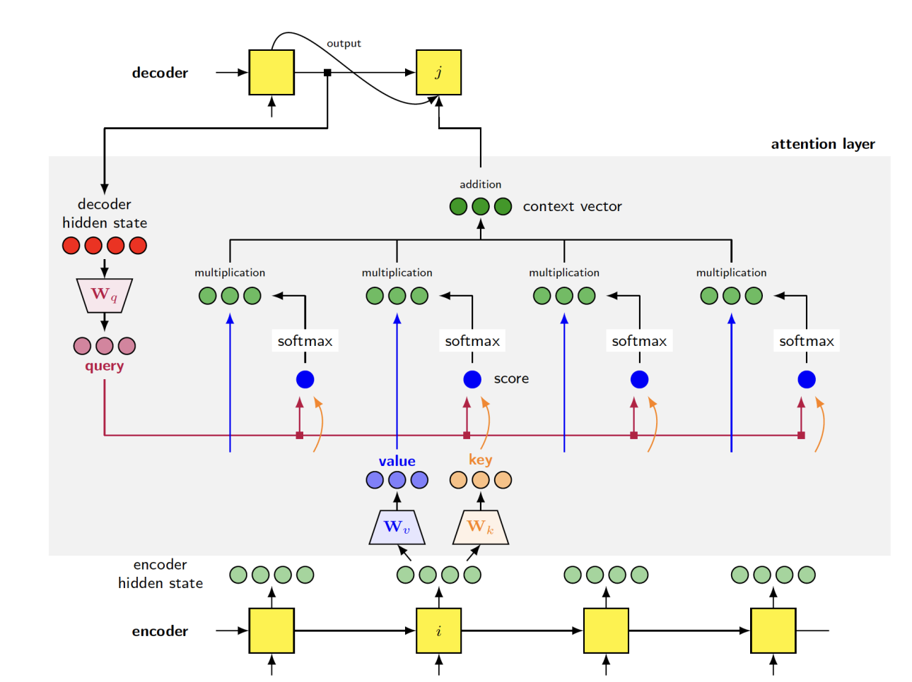
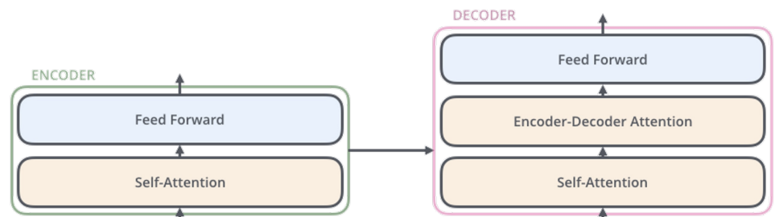

# Transformer

## More about Attention Mechanism

    어텐션 메커니즘은 모델이 문장이나 문서와 같은 순차적 정보를 처리하는 동안 입력 데이터의 특정 부분에 집중할 수 있도록 하는 자연어 처리(NLP)의 기본 구성 요소입니다.

    어텐션 메커니즘을 통해 모델은 입력 시퀀스의 다른 단어 또는 요소에 다른 가중치 또는 중요도를 할당할 수 있습니다. 그렇게 함으로써 출력을 생성하거나 예측을 할 때 입력의 관련 부분에 선택적으로 주의를 기울일 수 있습니다. 

    어텐션 메커니즘을 이해하기 위해 기계 번역의 예를 살펴보겠습니다. "The cat is sit on the mat"라는 영어 문장을 프랑스어로 번역하고 싶다고 가정해 보겠습니다. 주의 메커니즘을 사용하면 번역 모델이 출력 번역에서 각 단어를 생성하는 것과 관련된 입력 문장의 특정 단어에 주의를 기울일 수 있습니다.

    이 주의 메커니즘은 모델이 소스 언어와 대상 언어의 단어 간의 종속성을 효과적으로 캡처할 수 있으므로 번역 정확도를 개선하는 데 도움이 됩니다. 또한 모델이 관련 부분을 선택적으로 처리하여 긴 문장이나 복잡한 구조를 처리할 수 있습니다.

    요약하면 NLP의 주의 메커니즘을 통해 모델은 출력을 생성하거나 예측하는 동안 입력 시퀀스의 다른 부분에 집중할 수 있습니다. 종속성을 캡처하고 입력 및 출력 시퀀스 사이의 단어를 정렬하여 다양한 NLP 작업의 정확도와 성능을 향상시키는 데 도움이 됩니다.

### Key-value description of attention
    NLP의 어텐션 메커니즘 맥락에서 키-값 설명은 어텐션 메커니즘을 수학적으로 표현하는 방법

    키: 키는 모델이 주목하는 정보를 나타냅니다. NLP에서 키는 문장의 단어나 문자열의 문자와 같은 입력 요소 또는 토큰으로 생각할 수 있습니다. 각 키는 해당 값과 연결됩니다.
    값: 값은 모델이 입력으로부터 학습한 정보를 나타냅니다. NLP에서 값은 입력 요소의 표현 또는 포함으로 간주될 수 있습니다. 이 값은 각 키와 관련된 의미 또는 컨텍스트 정보를 캡처합니다.
    쿼리: 쿼리는 모델이 키-값 쌍에서 가장 관련성이 높은 정보를 찾으려는 요소입니다. 일반적으로 모델의 현재 상태 또는 출력을 나타냅니다. 쿼리는 주의 가중치를 계산하는 데 사용되어 각 키의 중요성 또는 관련성을 나타냅니다.

    어텐션 메커니즘은 쿼리와 키 간의 유사성을 측정하여 어텐션 가중치를 계산합니다. 이 유사성은 종종 내적 또는 신경망 기반 함수와 같은 유사성 함수를 사용하여 계산됩니다. 주의 가중치는 출력을 생성하거나 예측을 할 때 각 값에 얼마나 많은 주의를 기울여야 하는지를 결정합니다.

    주의 가중치를 얻으면 해당 값을 가중치로 사용합니다. 값에 각각의 어텐션 가중치를 곱하고 가중치를 합산하여 컨텍스트 벡터를 얻습니다. 이 컨텍스트 벡터는 쿼리 또는 모델의 현재 단계와 관련된 입력의 유인 또는 집중 정보를 나타냅니다.

    어텐션의 키-값 설명은 쿼리를 기반으로 특정 요소에 초점을 맞추면서 입력 요소(키)와 관련 정보(값) 간의 관계를 모델링하는 방법을 제공합니다. 이를 통해 모델은 입력의 관련 부분에 선택적으로 참석하여 NLP 작업에서 종속성을 캡처하고 정보에 입각한 예측을 수행하는 기능을 향상할 수 있습니다.

### Encoder
    인코더는 기계 번역이나 텍스트 생성과 같은 자연어 처리(NLP) 작업에 사용되는 많은 시퀀스-시퀀스 모델의 중요한 구성 요소입니다. 

    각 인코더는 self-attention layer와 feed-forward neural network layer의 두 하위 계층으로 구성됩니다.

    self-attention 계층은 인코더가 각각의 특정 단어를 처리할 때 입력 문장 내의 서로 다른 단어 간의 관계를 고려할 수 있도록 합니다. 이를 통해 인코더는 입력 문장의 다른 단어를 보고 단어 간의 종속성 및 컨텍스트 정보를 캡처할 수 있습니다. 이 self-attention 메커니즘은 모델이 입력 내에서 다른 단어의 관계와 중요성을 이해하는 데 도움이 됩니다.

    완전히 연결된 계층이라고도 하는 피드포워드 신경망 계층은 인코더의 또 다른 구성 요소입니다. 이 계층은 동일한 피드포워드 신경망을 입력 시퀀스의 각 위치 또는 단어에 독립적으로 적용합니다. 즉, 정확히 동일한 가중치 및 편향 세트가 각 위치에 사용되며, 이를 매개변수 공유라고 합니다. 이 매개변수 공유는 시퀀스의 모든 단어에 동일한 변환이 일관되게 적용되도록 합니다.

    피드포워드 신경망 계층의 매개변수는 다른 계층의 인코더 간에 공유되지 않는다는 점에 유의해야 합니다. 각 인코더에는 고유한 매개변수 세트가 있지만 단일 인코더 내에서 동일한 매개변수 세트가 모든 위치에 적용됩니다.

### Decoder
    디코더는 입력 시퀀스의 인코딩된 정보를 기반으로 출력 시퀀스를 생성하는 역할을 합니다.

    디코더는 피드 포워드 계층, 인코더-디코더 주의 계층 및 자체 주의 계층의 세 가지 하위 계층으로 구성됩니다.

    피드포워드 레이어는 인코더의 피드포워드 레이어와 유사합니다. 이들은 디코더 입력의 각 위치에서 정보를 독립적으로 처리하는 완전히 연결된 신경망 계층입니다.

    어텐션 레이어는 디코더가 입력 문장의 관련 부분에 집중하는 데 도움이 되는 중요한 구성 요소입니다. 이 어텐션 레이어를 통해 디코더는 입력 시퀀스의 인코딩된 표현에 맞춰 정렬할 수 있습니다. 입력 시퀀스에서 각 위치의 중요성 또는 관련성을 반영하는 주의 가중치를 계산하여 이를 달성합니다. 입력의 관련 부분에 주의를 기울임으로써 디코더는 보다 정확하고 상황에 맞는 적절한 출력을 생성할 수 있습니다. 이 메커니즘은 모델이 디코딩 프로세스 중에 입력 시퀀스의 다른 부분에 주의를 기울이는 sequence-to-sequence 모델에서 사용되는 주의와 유사합니다.

    self-attention 계층은 디코더가 자체적으로 생성된 출력 시퀀스 내에서 서로 다른 단어 간의 관계를 고려할 수 있도록 합니다. 디코더가 지금까지 생성한 단어 사이의 종속성 및 컨텍스트 정보를 캡처하는 데 도움이 됩니다. 이 자체 주의 메커니즘을 통해 디코더는 자체 출력에서 ​​관련 컨텍스트를 통합하고 보다 일관되고 컨텍스트 인식 예측을 생성할 수 있습니다.

    전반적으로, 피드 포워드 계층, 인코더-디코더 주의 계층 및 자체 주의 계층이 있는 디코더는 입력에서 인코딩된 정보를 활용하고 두 입력의 관련 부분에 주의를 기울여 출력 시퀀스를 생성하는 데 중요한 역할을 합니다. 그리고 자체 출력. 이를 통해 디코더는 지금까지 입력 및 생성된 출력에 존재하는 컨텍스트 및 종속성을 기반으로 의미 있고 정확한 예측을 생성할 수 있습니다.

## Self Attention
    셀프 어텐션: 1단계
        첫 번째 단계에서는 인코더의 각 입력(임베딩) 벡터에서 세 개의 벡터(쿼리, 키 및 값)가 생성됩니다. 이러한 벡터는 임베딩 벡터에 3개의 훈련 가능한 행렬을 곱하여 얻습니다. 쿼리, 키 및 값 벡터의 크기는 일반적으로 임베딩 크기보다 작습니다. 원본 논문에서 쿼리/키/값 벡터는 64차원이고 임베딩 벡터는 512차원입니다.

    셀프 어텐션: 2단계
        두 번째 단계는 입력 시퀀스의 각 단어에 대한 self-attention 점수를 계산하는 것입니다. 이 점수는 특정 위치에서 특정 단어를 인코딩할 때 입력의 다른 부분에 두어야 하는 중요도 또는 초점 수준을 결정합니다. 점수는 쿼리 벡터와 점수를 매기는 단어의 키 벡터 사이의 내적을 취하여 계산됩니다.

    셀프 어텐션: 3단계
        세 번째 단계에서는 주의 점수를 정규화합니다. 이 정규화는 두 가지 하위 단계로 수행됩니다.

        3-a) 어텐션 점수를 키 벡터 크기의 제곱근으로 나눕니다. 원본 논문에서 키 벡터 크기는 64(앞서 언급한 대로)이므로 8로 나눕니다. 이 정규화는 훈련 중에 보다 안정적인 기울기를 달성하는 데 도움이 됩니다.

        3-b) 정규화된 어텐션 스코어에 소프트맥스 연산을 적용한다. 이 작업은 점수를 확률로 변환하여 각 단어에 대한 위치 확률을 제공합니다. softmax는 입력 시퀀스의 각 단어에 대한 주의 가중치를 나타내는 확률 합계가 1이 되도록 합니다.

    셀프 어텐션: 4단계
        네 번째이자 마지막 단계는 self-attention 레이어의 출력을 계산하는 것입니다. 이것은 3단계에서 얻은 주의 점수가 가중치 역할을 하는 값 벡터의 가중 합계를 취함으로써 수행됩니다. 출력은 주의 점수를 기반으로 관련 정보를 통합하여 입력 시퀀스의 유인 또는 집중 표현을 나타냅니다.

### Multi-head Attention
    Self-Attention 메커니즘의 확장입니다. 어텐션 헤드라고 하는 여러 세트의 어텐션 웨이트를 사용하여 어텐션 메커니즘의 표현력과 유연성을 향상시킵니다.

    기존의 self-attention에서는 쿼리, 키 및 값 벡터의 단일 집합을 사용하여 주의 점수를 계산하고 유인 표현을 생성합니다. 다중 헤드 어텐션에서 이 프로세스는 입력 벡터의 서로 다른 학습된 선형 프로젝션을 사용하여 여러 번 반복되어 여러 세트의 쿼리, 키 및 값 벡터를 얻습니다. 각 세트를 어텐션 헤드라고 합니다.

    다중 헤드 어텐션의 핵심 아이디어는 서로 다른 어텐션 헤드가 입력 시퀀스의 다른 부분 또는 측면에 집중할 수 있다는 것입니다. 각 어텐션 헤드는 데이터에서 특정 관계, 패턴 또는 의미론적 정보를 캡처하는 데 특화될 수 있습니다. 입력의 다른 부분에 주의를 기울임으로써 모델은 더 풍부하고 다양한 범위의 정보를 캡처할 수 있습니다.

    각 어텐션 헤드에 대한 어텐션 점수를 얻은 후 모든 어텐션 헤드의 출력을 연결하고 선형 변환하여 다중 헤드 어텐션 레이어의 최종 출력을 생성합니다. 서로 다른 어텐션 헤드의 이러한 조합을 통해 모델은 로컬 및 글로벌 종속성을 모두 캡처하고, 입력의 다른 부분에 동시에 주의를 기울이고, 데이터의 다양한 언어 속성 또는 패턴을 처리할 수 있습니다.

#### Summary
   
    Self-attention을 사용하면 모델이 입력 시퀀스의 다른 부분에 집중할 수 있으며, Cross-attention을 사용하면 sequence-to-sequence 작업의 경우처럼 모델이 입력 및 출력 시퀀스 모두에 주의를 기울일 수 있습니다. 소프트 어텐션은 어텐션 가중치를 확률 분포로 할당하는 반면, 하드 어텐션은 이산 어텐션 가중치를 사용합니다. 또한 주의는 전체 입력 시퀀스를 고려하여 전역적일 수도 있고 특정 창 또는 입력 영역에 초점을 맞추는 로컬일 수도 있습니다.

    Transformer 모델은 동일한 백서에서 소개된 특정 아키텍처입니다. sequence-to-sequence 작업을 위해 인코더-디코더 구조를 사용합니다. 인코더는 self-attention layer와 feed-forward layer로 구성되며, decoder는 masked self-attention, cross-attention, feed-forward layer로 구성됩니다. 다중 헤드 어텐션 메커니즘이 활용되어 모델이 입력 시퀀스에서 다양한 측면과 관계를 캡처할 수 있습니다.

