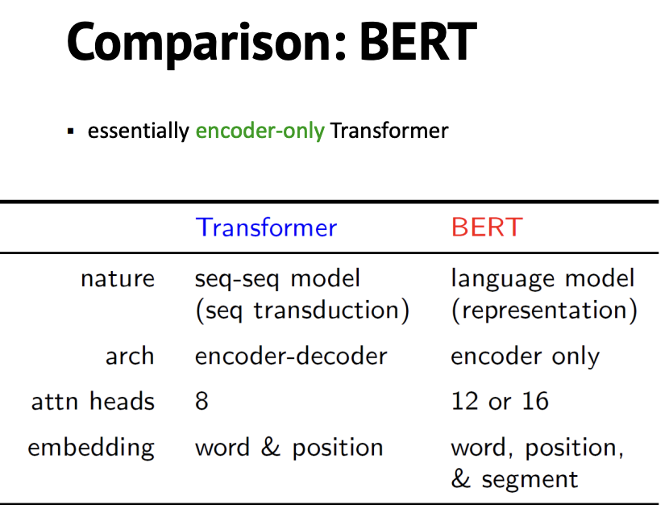
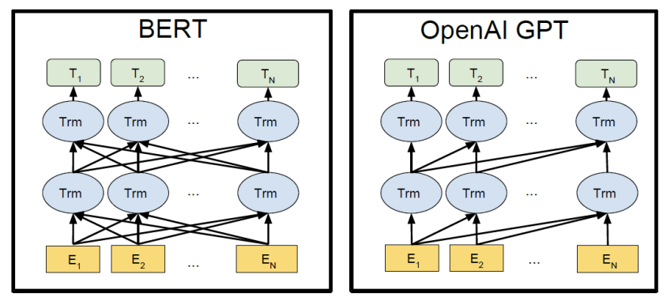
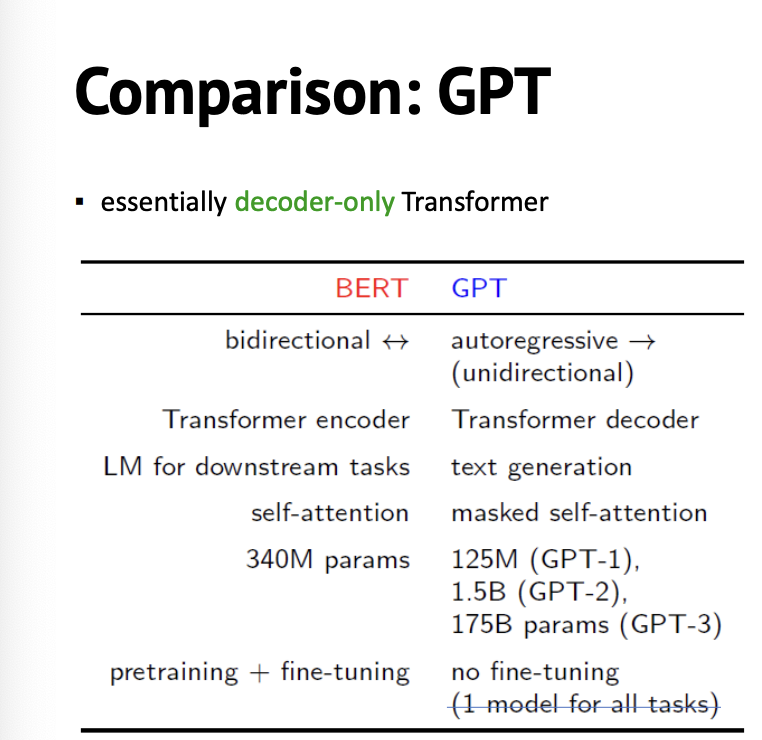

## BERT
BERT(Bidirectional Encoder Representations from Transformers)는 다양한 자연어 처리 작업에 사용할 수 있는 언어 표현 모델입니다. 레이블이 지정되지 않은 텍스트 데이터를 활용하여 깊은 양방향 표현을 사전 훈련할 수 있습니다. 왼쪽 또는 오른쪽 컨텍스트만 고려하는 기존 모델과 달리 BERT는 아키텍처의 모든 계층에서 왼쪽 및 오른쪽 컨텍스트를 모두 고려합니다.

BERT의 주요 장점 중 하나는 특정 작업에 대한 단일 추가 출력 계층만으로 미세 조정할 수 있다는 것입니다. 따라서 매우 다재다능하며 질문 응답, 텍스트 분류 등과 같은 다양한 작업에서 최첨단 성능을 달성할 수 있습니다. 중요한 것은 당면한 특정 작업을 위해 모델의 아키텍처를 크게 수정하지 않고도 이 미세 조정을 수행할 수 있다는 것입니다.

어떤 면에서 BERT는 자연어 처리를 위한 노이즈 제거 자동 인코더로 생각할 수 있습니다. 손상된 버전에서 원래 입력 텍스트를 재구성하여 언어 표현을 인코딩 및 디코딩하는 방법을 학습합니다. 이 프로세스를 통해 BERT는 풍부한 컨텍스트 정보와 의미론적 표현을 캡처하여 다양한 다운스트림 작업에서 효율성을 이끌어냅니다.

전반적으로 BERT는 자연어 처리 분야를 크게 발전시킨 강력한 언어 표현 모델로 부상하여 광범위한 작업에 대해 표현력이 뛰어나고 효과적인 표현을 제공합니다.

## GPT
OpenAI GPT(Generative Pre-trained Transformer)는 Transformer 아키텍처를 사용하는 감독되지 않은 사전 교육 측면에서 BERT와 유사한 아이디어를 따릅니다. 그러나 두 모델의 디자인에는 중요한 차이점이 있습니다.

BERT는 양방향 변환기를 기반으로 하며, 여기서 모델은 왼쪽 및 오른쪽 컨텍스트 모두에서 컨텍스트 표현을 학습합니다. 이러한 양방향 특성을 통해 BERT는 양방향에서 종속성을 캡처할 수 있으므로 전체 컨텍스트를 이해해야 하는 작업에 유용할 수 있습니다.

반면 GPT는 왼쪽에서 오른쪽으로 변환하는 변환기를 기반으로 합니다. 즉, Transformer 아키텍처의 디코딩 측면에 중점을 둡니다. GPT는 왼쪽 컨텍스트에 주의를 기울이고 주어진 시퀀스에서 다음 단어를 예측하여 일관되고 의미 있는 시퀀스를 생성하는 방법을 학습합니다. 이 왼쪽에서 오른쪽으로 생성하는 프로세스를 통해 GPT는 이전 단어를 기반으로 데이터의 종속성과 패턴을 캡처할 수 있습니다.

따라서 BERT와 GPT는 모두 감독되지 않은 사전 교육과 Transformer 아키텍처를 사용하지만 주요 차이점은 Transformer의 방향성에 있습니다. BERT는 양방향 컨텍스트를 고려하는 인코더 전용 모델인 반면 GPT는 왼쪽에서 오른쪽으로 시퀀스를 생성하는 데 중점을 둔 디코더 전용 모델입니다.

