# Traditional NLP

## Supervised Learning Paradigm

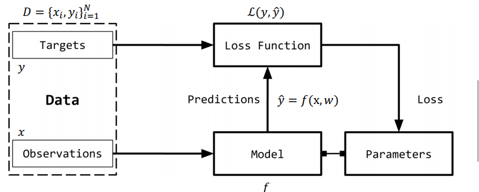

    ##Observation(input)
    - x로 주로 사용
    - 우리가 예측해야할 무언가

    #Target(LABEL)
    - observation과의 일치성기반
    - 예측되어야 할것
    - Y

    #Model
    - 함수 및 수학적 표현
    - x를 통해 y를 예측

    #Parameter
    - model의 파라미터
    - w로 주로 사용

    #Predictions
    - 주어진 observation, model에 넣어 target을 예측
    - 𝑦햇 으로 표현

    #Loss function, ℒ(𝑦, 𝑦햇)
    - target과 predictions과의 비교

## One-Hot Representation(C)

    - 0 벡터로 시작하고 있는 경우 벡터 해당 항목을 1로 설정
    - text->num으로 바꾸는 가장 원초적 방법

## TF Inverse Document Frequency(TF-IDF)(C)

    - fruit가 두번나왔고 이는 topic이 fruit라고 추측가능
    - 하지만 topic아 아니여도 자주나오는 단어가 있을 수 있음(반대의 경우도 존재)
    - 사진과 같이 penalize하는것이 있음(중요하지 않은 단어인데 자주 나오는것을 penalty를 준다)

| 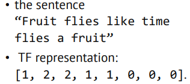 | 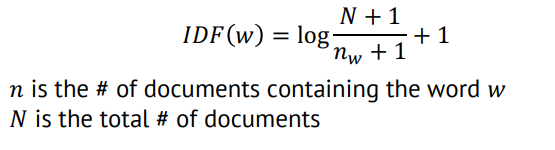 |
| ---------------- | ---------------- |

## Word Vectors

    비슷한 의미의 단어는 내적의 크기가 크도록 설정
    ex) motel, hotel

# Text Preprocessing

## Corpus(C)

    text data set
    raw data

## Tokenization(C)

    text분석의 초기 step
    text를 작은 token으로 쪼갬
    spacy, nltk를 통한 sentence 쪼개기

| 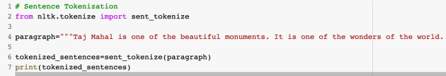 | 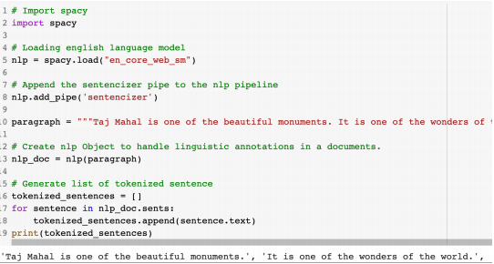 |
| ---------------- | ---------------- |

## StopWords(C)

    words= content words+ stopwords
    크기 의미가 없는 단어 ex) by, about...
    NLP analysis에서는 삭제가 필수적임

|  | 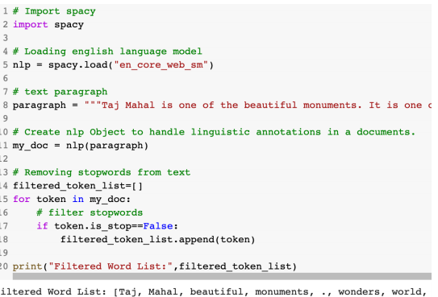 |
| ---------------- | ---------------- |

## Stemming(C)

    text 일반화
        ex- consultant, consulting, consultantiative.. => consult

## Lemmatization(C)

    context를 기반하여 구분(stem과의 차이)

| 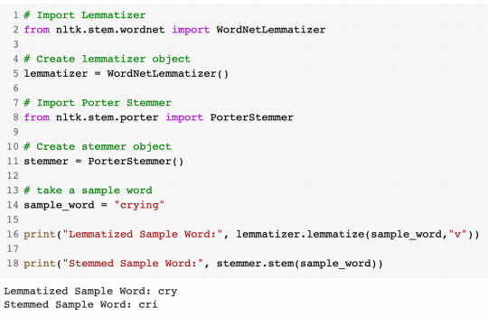 | 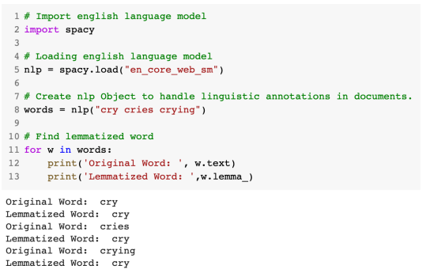 |
| ---------------- | ---------------- |

## POST tagging(C)

    동사, 명사 , 형용사 등을 구분
    문장에서의 relationship을 찾음

| 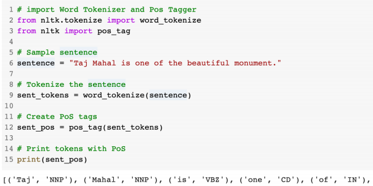 | 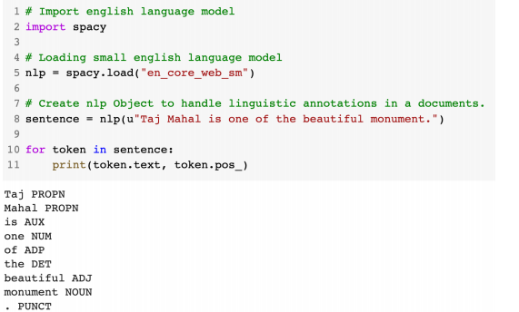 |
| ----------------- | ----------------- |

## Recognizing entities(C)

    sentence에서 main thing을 찾는것

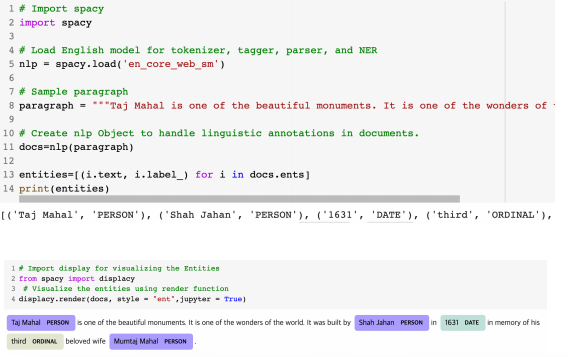

## Dependency Parsing(C)

    단어에서의 관계를 찾음

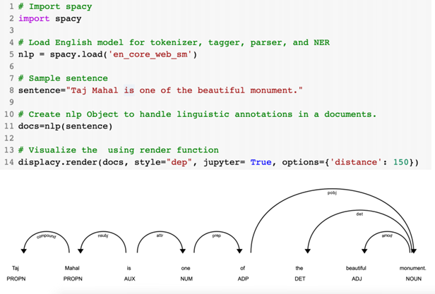

## Word Cloud(C)

    가장 빈번하게 나온 단어를 graphic화
    주로 광고에서 사용됨
    많이 나올수록 사이즈가 큼

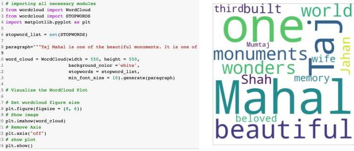

# Text Feature Engineering

## Bag of Words(C)

    text-> numeric vector로 바꾸는 가장 인기있고 간단한 방법
    1. vocabulary words를 수집
    2. 빈번도 분석

## n-gram

단어를 n개로 묶어서 분석

# Text Similarity(유사도 비교)

## Jaccard similarity(C)

| 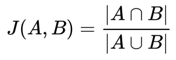 | 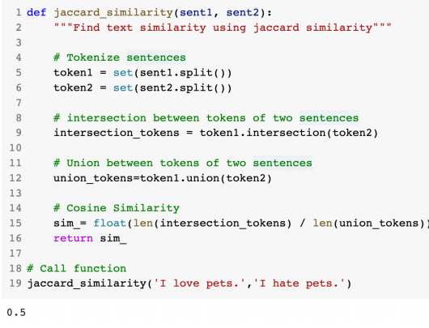 |
| ----------------- | ----------------- |

    두개의 set에 대한 유사도 ratio

## Cosine similarity(C)

| 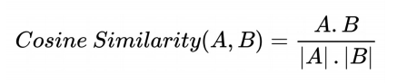 | 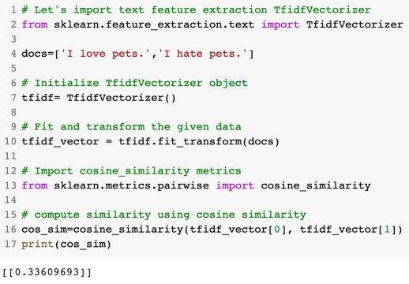 |
| ----------------- | ----------------- |

    얼마나 서로 관련이 있는지 계산
    bag of words, TF-IDF 둘다 사용 가능
