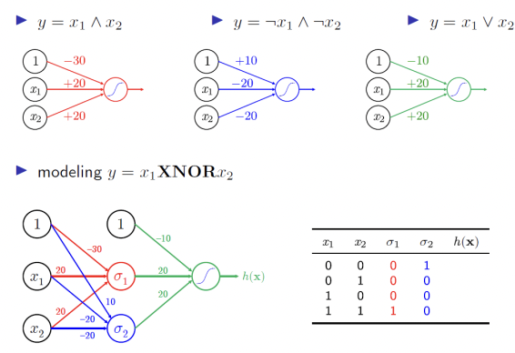

# MLP and CNN for NLP

# MultiLayer Perceptron
    여러개의 multi layer의 neurons
    병렬적
    여러개의 output
    좀더 여러개의 output결과를 분리할 수 있음(두번째 사진)
    non-linear transformation을 사용해  linear로 변환
        => 최종적으로 하나의 Linear로 변환되도록 구성 가능
    중간 layer는 feature detector 역할
        non-linear transformation을 통해 Input data를 새로운 feature space로 변경
        traning data의 중요 정보를 추출
~~~
self.fc1=nn.Linear(input_dim, hidden_dim)
self.fc2=nn.Linear(hidden_dim, output_dim)
//다음과 같이 하나의 hidden layer 사용
~~~

|  |  |
| ----------------- | ----------------- |

## ex
| |  | 
| ----------------- | ----------------- | 

| | | |
|----------------- |----------------- |----------------- |

# Surname Classfication w\MLP

- dataset 정의=> vectorized 된 surname, nationality index를 얻음
- 위의 과정이 결국 text-> vectorized minibatches
    1. 각 토큰 -> integer mapping
    2. mapping 된 데이터를 vectorized form으로 변경
    3. vectorized된 데이터를 grouping을 통해 minibatch형태

- vocabulary를 vector로 변환
- ex)yun:[0,0,0,....1,1,1]
    - 해당 방법은 sequence 를 고려하지 않음

#### surnameClassifier는 위의 mlp와 코드가 거의 같음

| |  | 
| ----------------- | ----------------- | 
- 객체 초기화
- 이후 traning

# Convolutional Neural Networks(CNN)
    input은 images
    images는 neural net에 맞지않음 -> fully connected되어 있기 때문
        한 픽셀마다 connected되어 있으면 wasteful 하다
    
    Covolutional Layer
        CNN의 core building block
        각 필터는 작게 세분화(하지만, full depth로 확장은 가능)
        filter는 w(weight)를 가지며 항상 동일한 가중치를 적용 => input끼리 가중치 sharing

# Surname Classification w\CNN
    dataset이 matrix of onehot vector로 구성 => 이전에 보장되지 않았던(1행) 순서가 3행을 통해 순서 보장
        [0,0,1,1,1]=>{[0,0,1,0,0],[0,0,0,0,1,0]...}
## ex
| |  | 
| ----------------- | ----------------- | 

-  index를 이용해 행(row)을 가져오고, 해당 행의 성(surname)을 벡터화하여 x_surname에 저장하고, 국적(nationality)을 y_nationality에 저장=> 특정 행의 데이터를 딕셔너리 형태 반환
- vectorize: martix형태로 vectorize(2차원의 one-hot-vector)

| | |
|----------------- |----------------- |

- kenrnel_size: filter의 세로 길이
- stride: fileter 이동간격 => 3개의 연속된 값으로 구성된 입력 데이터를 처리
- filter => ELU => ELU => ELU ....(Exponential Linear Unit)
- 각 계층의 출력에는 nn.ELU 함수를 적용하였습니다
- convnet을 통해 num_channels를 계속 업데이트 하고 최종적으로  num_classes개를 출력 
