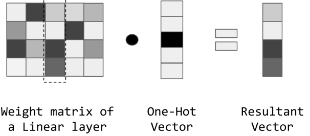
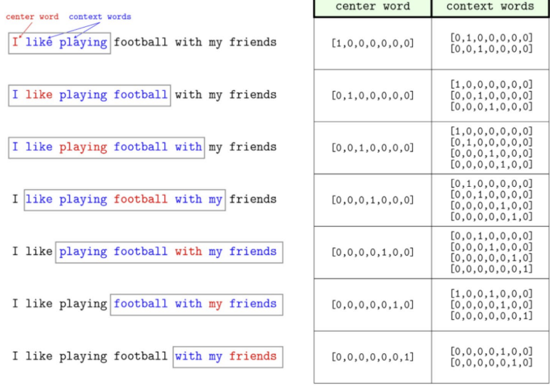
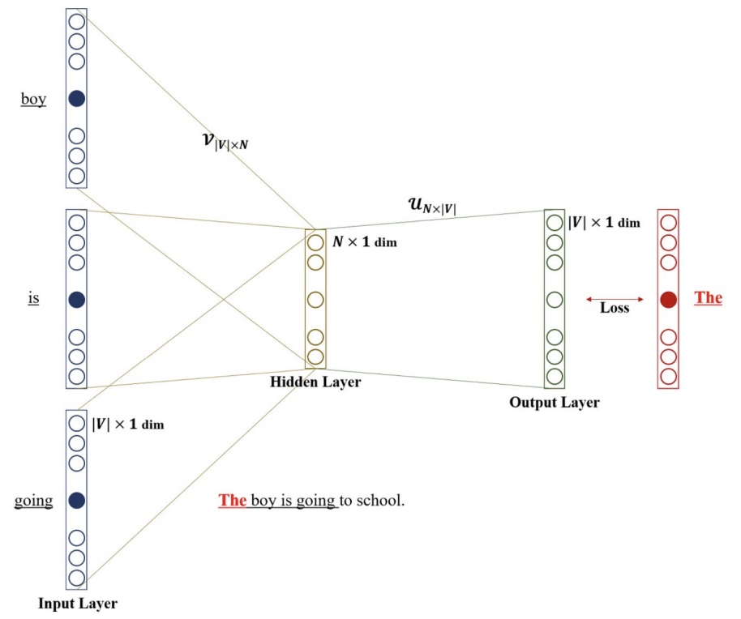
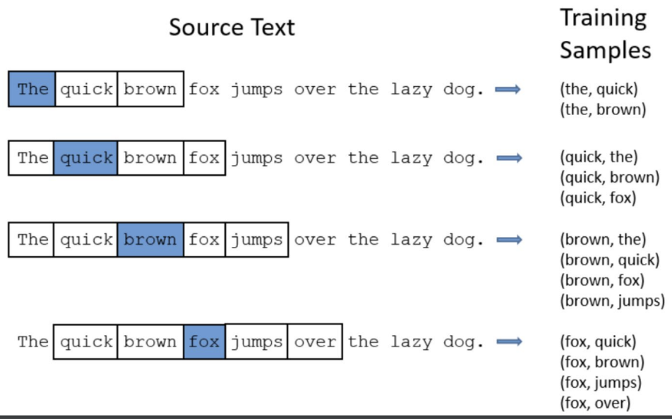
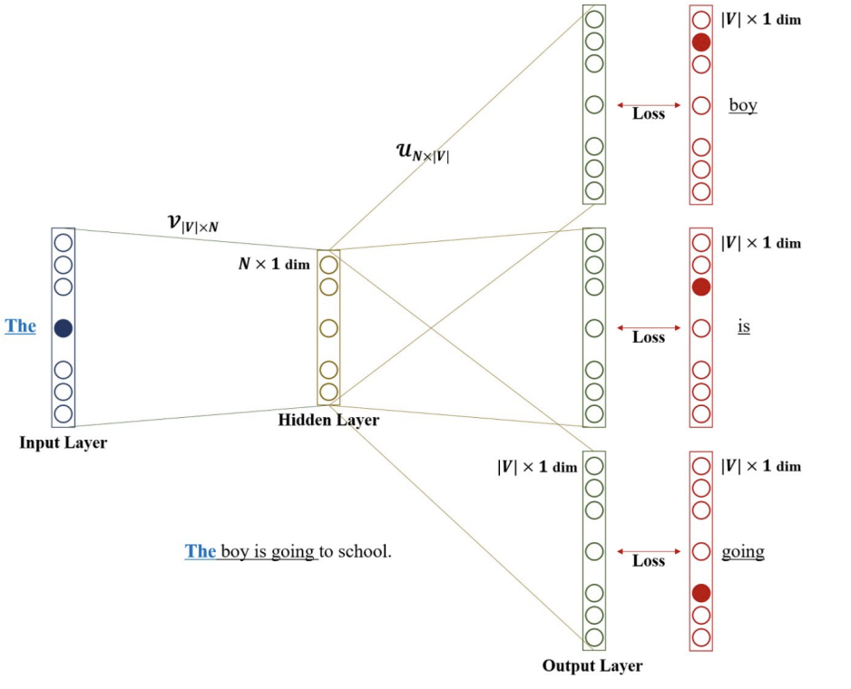
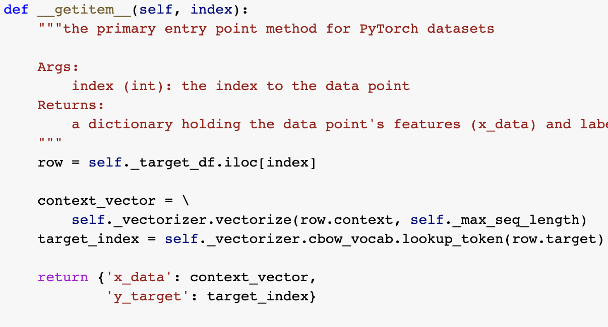
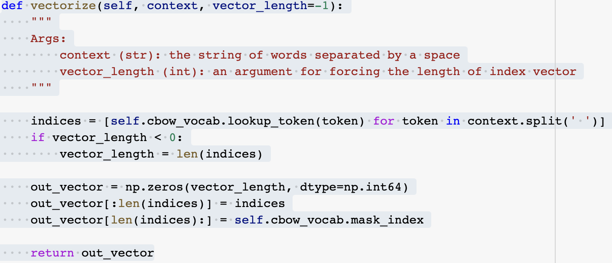
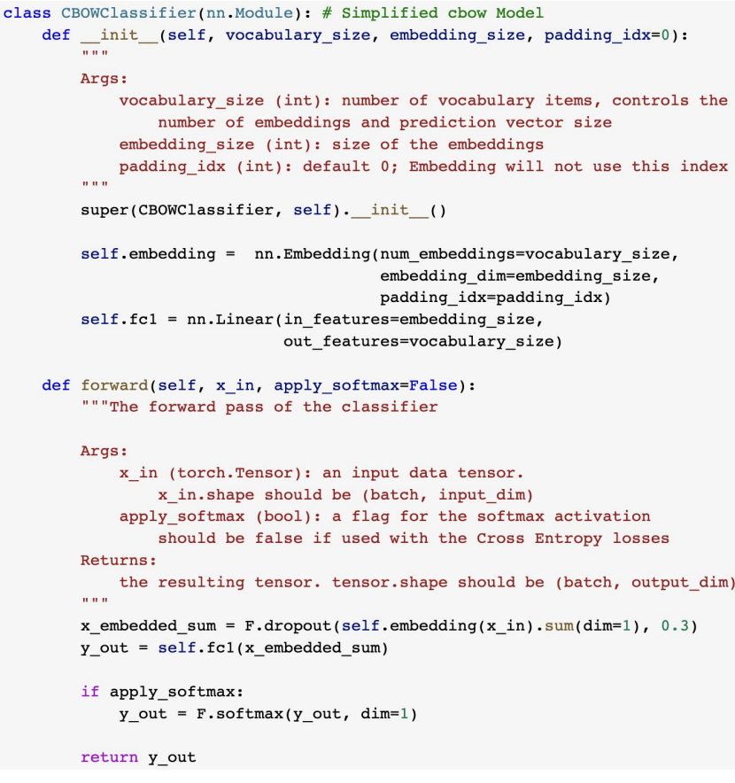
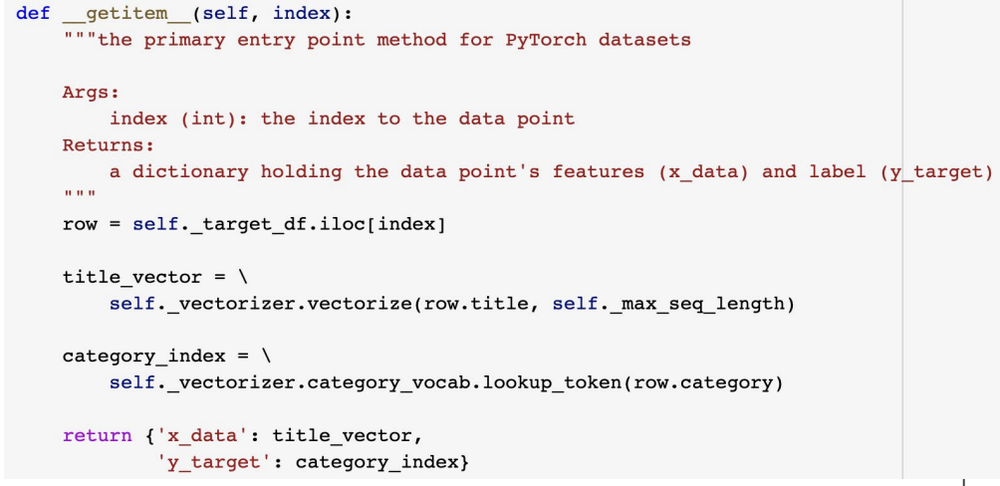
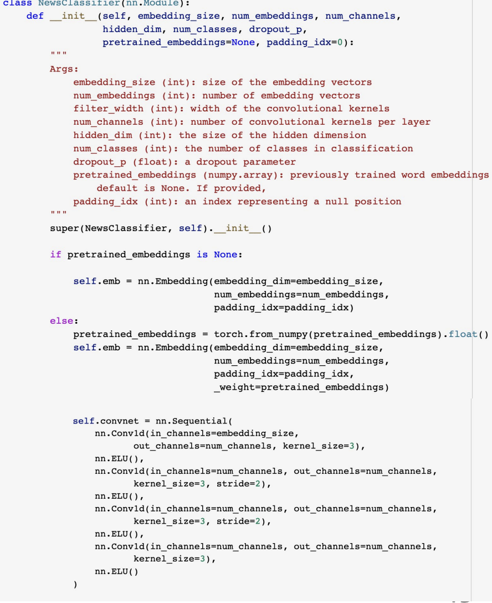

# Embedding

# Why and How about "Embedding"

## One-Hot Representation
    해당 단어가 존재하면 vector의 값을 1
    단점: 
        - 만약 50000개의 단어가 있는 사전이 있으면 ,각 단어마다 50000길이의 vector가 필요
        - motel, hotel의 실제 의미는 비슷하지만 vector상으론 관련이 없을  수 있음

## TF Representation(Term Frequency)
    문서가 나타나는 빈도수
    만약 fruit가 두번 나오면 해당 vector에 2

## TF IDF(TF Inverse - Document Frequency)
    많이 나오는 단어이지만 별로 안중요 할 수 도 있음
    반대로 적게 나오는 단어이지만 중요할 수 있음
    => w라는 가중치를 부여
    IDF(w)= log(N+1/nw+1)+1 (N: 전체 document수, n: 특정 단어가 포함되어 있는 수)

## Word Vector
    각 단어를 dense vector로 표현
    문맥을 기반으로 vector를 생성하기에 비슷한 의미의 단어는 비슷한 vector를 가짐
    vector dot product 사용(내적)
    Word2Vec 알고리즘:
        주변 단어들의 출현 빈도를 통해 각 단어를 벡터로 표현

## Efficiency of Embedding Matrix
    단어를 vector로 변환시 weight 사용
    해당 입력 단어를 one-hot encoded된 vector로 표현
    => 임베딩 행렬(단어)* one hot vector = 임베딩에서 선택한 크기의 vector한줄과 같음

## Approaches to Learning Word Embeddings
    원래 단어는 unlabeld data이지만 supervised하게 대략적으로 학습할 수 있음
        1. i like ? => Language Modeling
        2. i _ doing sport Continuous Bag of Word(CBOW)
        3. _ _ lunch  _ _  skipgrams

## Word2Vec
    단어를 학습하기 위한 framework
    CBOW나 skipgram으로 나뉨
    1. 많은 양의 텍스트(코퍼스)를 가지고 있다.
    2. 고정된 어휘집(vocabulary)에 있는 각 단어는 벡터로 표현됩니다.
    3. 텍스트에서 각 위치 t마다 중심 단어 c와 주변 단어 o(콘텍스트)가 있습니다.
    4. 중심 단어 c와 주변 단어 o의 벡터 유사성을 사용하여 o가 c에 주어졌을 때(또는 그 반대), o의 확률을 계산합니다.
    5. 이 확률을 최대화하기 위해 단어 벡터를 조정합니다.

## CBOW
    i _ doing sport 과 같이 before, after가 주어지고(input), 중간 단어 예측(output)
    아래의 사진 보면 최종적으로 predict 해야하는것 center-word이며, context words가 input으로 주어지며 해당 값으로 center word를 예측
| |  | 
| ----------------- | ----------------- | 

## SkipGram
    center word로 부터 context word 예측
    데이터가 더 적을때 우수
    multiple output
    중간에 embedding matrix존재 할 수도?
| |  | 
| ----------------- | ----------------- | 

# Example: Continuous Bag of Words Embeddings
| 코드| 설명| 
| ----------------- | ----------------- | 
| | index에 해당하는 데이터 셋을 가져옴(해당 데이터는 context, target으로 구성됨). 이후 context는 vector화, target을 통해 target index를 가져옴 -> 인덱스로 매핑해야 인공신경망에 넣기 가능|
| | 위에서 selt_vectorize.vectorize에 사용. context를 vector화 하기 위해 사용되는 함수|
| | nn.Embedding 레이어와 nn.Linear 레이어로 구성됩니다. nn.Embedding 레이어는 임베딩 매트릭스를 생성하는 역할을 하며, nn.Linear 레이어는 입력 벡터와 가중치 행렬의 곱을 통해 예측 벡터를 생성합니다. forward 메서드는 입력값 x_in(context words가 담근 tensor)을 받아 임베딩 벡터를 구하고, 이를 더한 후, nn.Linear 레이어를 통과시켜 예측 벡터를 구합니다.|

# Example: Transfer Learning Using Pretrained Embedddings for Documents Classification(이미 만들어져 있는것을 사용)
| 코드| 설명| 
| ----------------- | ----------------- | 
| | index에 해당하는 dataset을 가져옴, title vector= context vector이므로 vector화, category=center word이므로 해당 단어에 맞는 Index를 가져옴|
| |  모델의 입력은 단어=  x_in(context words) 이 시퀀스는 임베딩 레이어를 통과한 후, 1D 컨볼루션 레이어를 거침 ,마지막 선형 레이어를 통해 클래스 예측값을 출력합니다.임베딩 벡터를 사전 학습된 임베딩 벡터로 초기화할 수 있는 옵션을 제공합니다. 이는 사전에 학습된 모델의 가중치를 가져와서 사용하는 전이 학습 기술 

