# Recurrenct Nueral Networks for NLP

# Fundamental RNN Architechtures
    neral networks의 군집체
    sequential data의 처리
    RNN:시퀀스 데이터를 처리하는 데 사용되는 인공 신경망 구조입니다. RNN은 이전 시점의 출력값을 현재 시점의 입력값으로 사용하여 순환 구조를 만들어 시퀀스 데이터의 특징을 파악합니다. RNN은 주로 자연어 처리 분야에서 활용되며, 번역, 감정 분석 등에 이용됩니다.
        ex- 음성, music, dna sequnece, video recognition

## (RNN modeling capability)
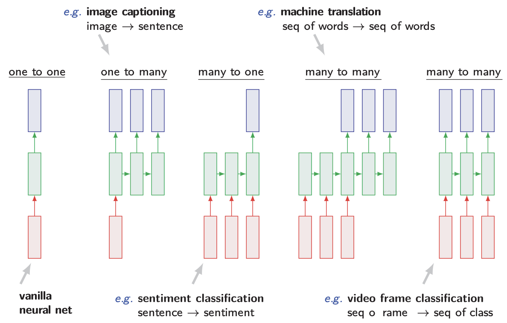

    (CNN과의 비교 알아두면 좋음)   
    CNN:이미지 인식 분야에서 주로 사용되는 인공 신경망 구조입니다. CNN은 입력 데이터의 특징을 추출하기 위해 필터(kernel)를 사용하고, 합성곱 연산을 통해 필터를 이용하여 입력 데이터를 처리합니다. CNN은 이미지 분류, 객체 검출 등 다양한 영상 처리 분야에서 활용됩니다. 최근에는 텍스트 데이터에서도 CNN을 활용하여 효과적인 특징 추출을 할 수 있게 되어 텍스트 분류 문제에서도 사용되고 있습니다.
|CNN|RNN|
|---|---|
|image와 같은 grid| seqence data x1x2....|
|wide 하고 tall 한 Image| long sequnece|
|다양한 이미지 처리| 연속적인 길이의 데이터 처리|

## RNN은 왜 vanilla neural net이 안될까? (Paramter Sharing)
    Problem
        input과 ouput이 고정된 길이
        feature에 대한 sharing이 없음 => 각 포지션에서 연관관계를 고려하지 못함
    Paramter Sharing
        model내에서 각 파트마다 공유된 parameter를 사용한다.
        RNN: same weight
        CNN: same kernel(same filter)
        하지만 input, output의 길이는 정해진것이 아니기에 길이에 상관없는 sharing 할 수 있는 무언가 필요
| 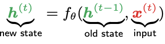| 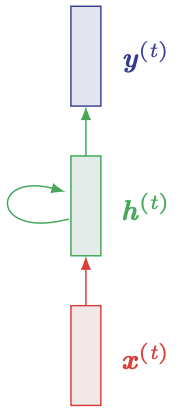 | 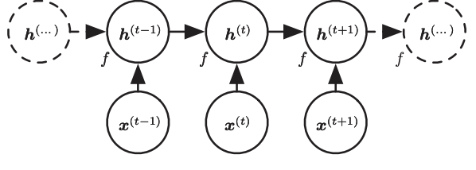 | 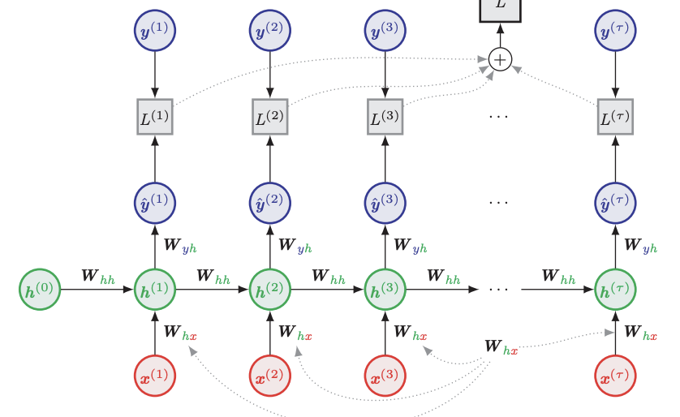 | 
| ----------------- | ----------------- |  ----------------- | ----------------- | 
- Rnn은 계속적으로 hidden state를 update
- hidden state는 loss Summary
     필요한것만 선택 저장하기에 오히려 더 정확하고 요약된 정보를 저장할 수 있음
- 마지막 예시는 many to many

## BPTT(Backpropagation Through Time): computing gradient through RNN
    RNN의 학습 알고리즘 중 하나
    RNN의 시간적 의존성을 고려
    Turncated BPTT
        sequnece를 chunk하게 나눠서  학습
        일반적인 BPTT는 기울기 손실 문제가 발생 할 수 있음
| 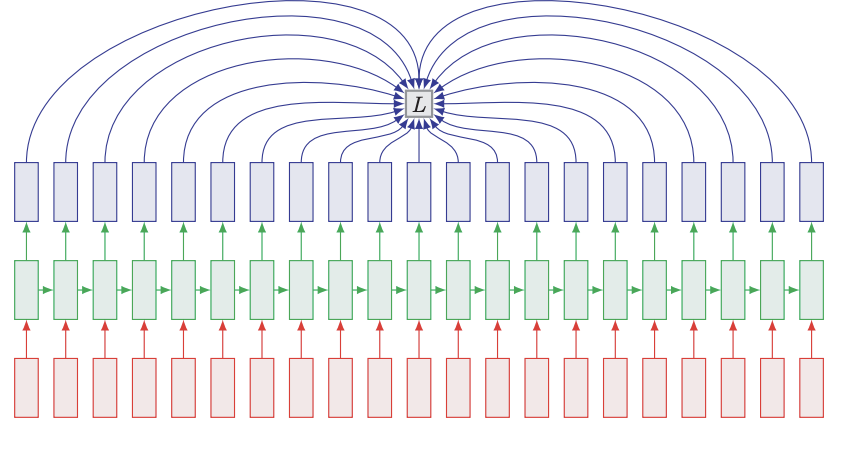| 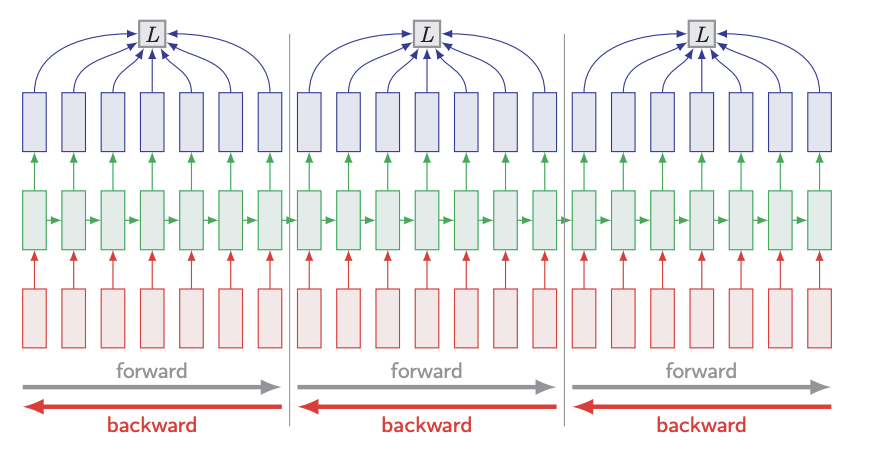 | 
| ----------------- | ----------------- | 

# Surname Classification

## MLP 사용
| 코드| 설명| 
| ----------------- | ----------------- |
| 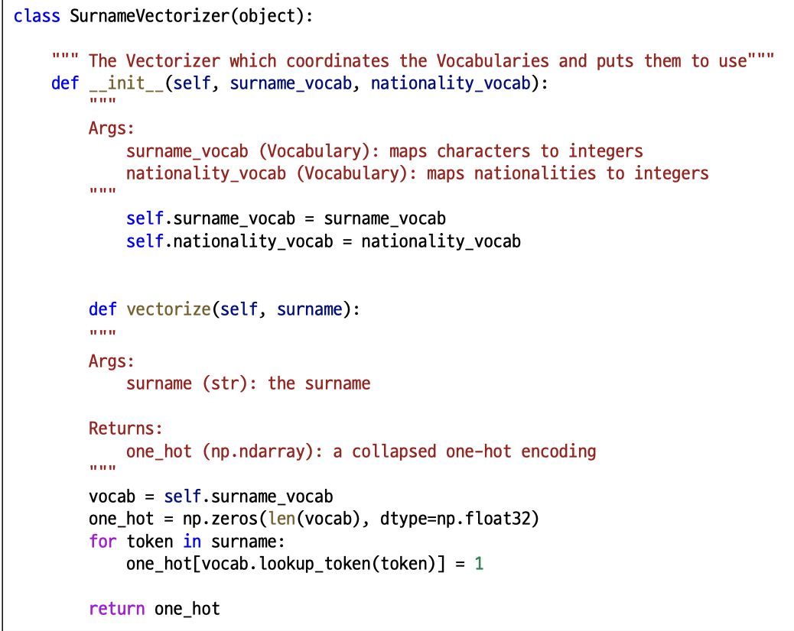| MLP는 하나의 배열인(1차원) one hot vector형태로 vectorize 함| 
| 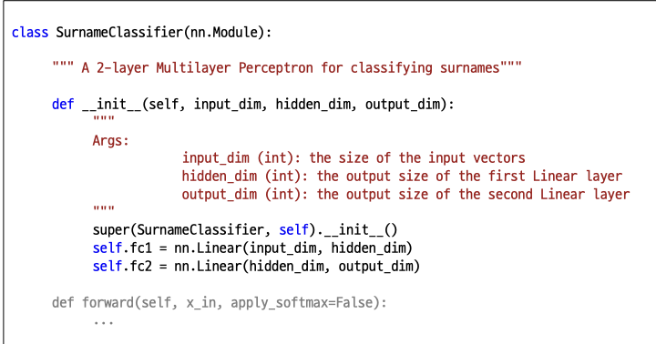| MLP는 입력층(input layer), 은닉층(hidden layer), 출력층(output layer)|
| 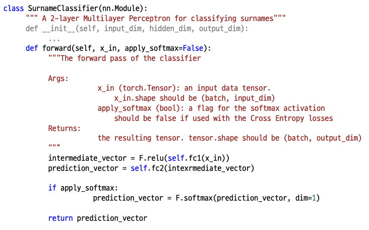|  F.relu() 함수를 사용하여 intermediate_vector의 값이 0 이상일 경우에만 값을 반환하도록 하여 음수값을 제거|

## CNN 사용
| 코드| 설명| 
| ----------------- | ----------------- |
| 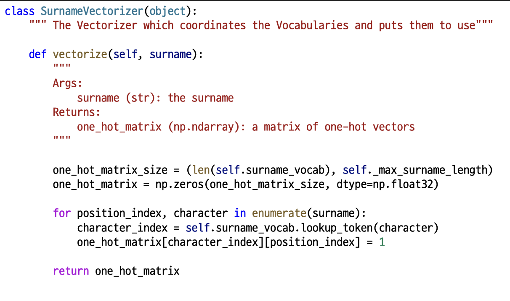| CNN는 surname을 matrix of one hot vector형태로 vectorize 함(즉 다중배열) 추후 filter적용| 
| 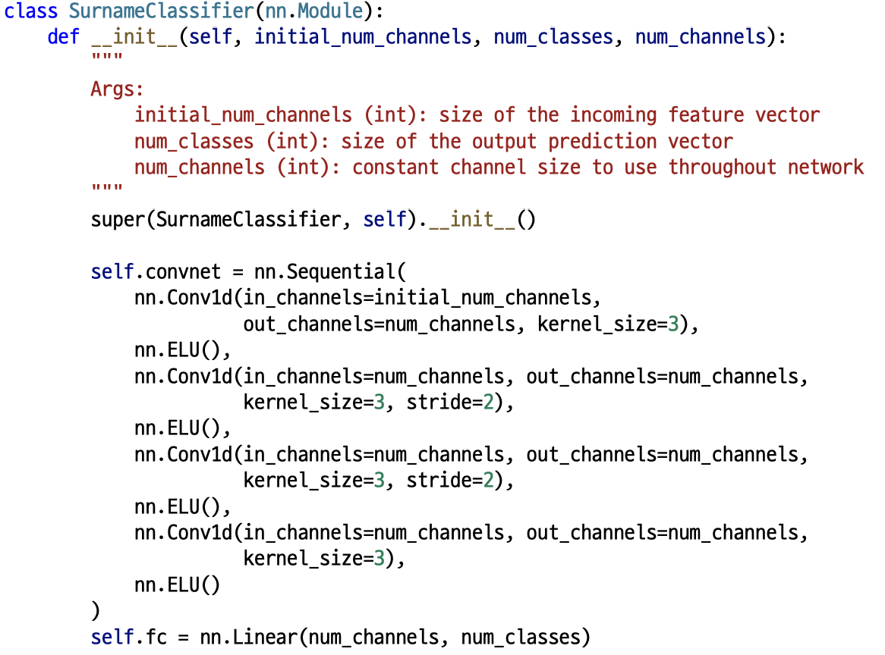| 위해서는 문자(character)를 vector로 나타내는 방법:입력 문자열을 vector로 바꾸기 위해서는, 문자(character)를 embedding하는 과정이 필요합니다. 하지만 이 모델에서는 embedding layer 대신에, Convolutional Neural Network(ConvNet)을 사용해서 입력 문자열의 feature를 추출,최종적으로 나온 feature map을 Linear layer에 input으로 넣어서, 예측(prediction)을 수행, Conv1d를 이용해서 문자(character)를 vector(embedding martrix)로 바꾸고, 이를 이용해서 예측(prediction)을 수행합니다.|
| 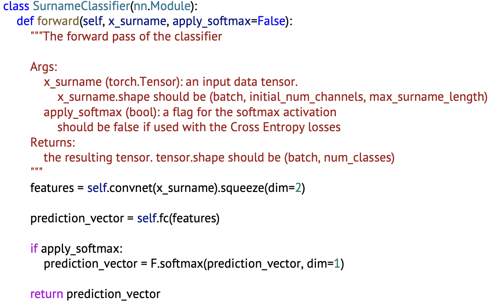|  입력 데이터 x_surname은 3차원 텐서, convnet을 통해 feature matrix생성한 후 feature를 통해 prediction vector를 생성|

## RNN사용
| 코드| 설명| 
| ----------------- | ----------------- |
| 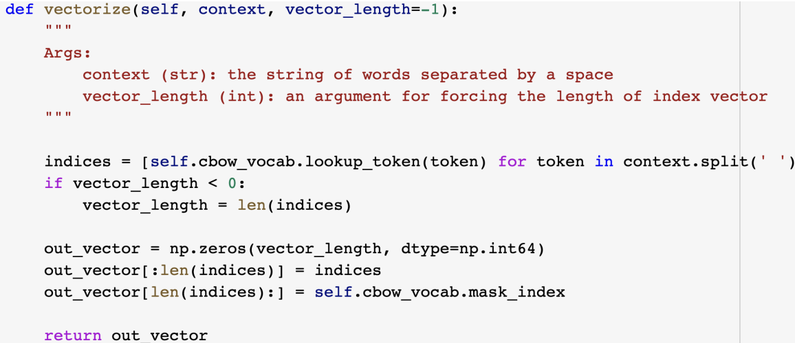| 단순 one-hot vector 생성x, 대신 정수 인덱스 벡터 생성, 각 알파펫에 맞는 tokend을 사용하여 Integer화| 
| 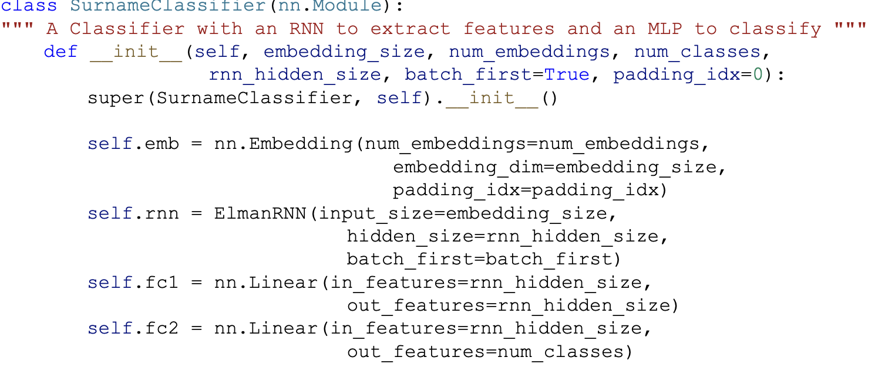| nn.Embedding:input-정수 인덱스 output- 임베딩 벡터를 반환하는 레이어입니다. ElmanRNN: hidden state를 업데이트하고, 마지막 시점의 hidden state를 반환하는 레이어 self.fc1: RNN 레이어의 출력을 입력으로 받고, rnn_hidden_size의 크기를 가진 중간 히든 레이어를 만듦. self.fc2: fc1의 출력을 입력으로 받고, 각 국적에 대한 확률을 예측하는 num_classes 크기의 출력 벡터를 생성.|
| 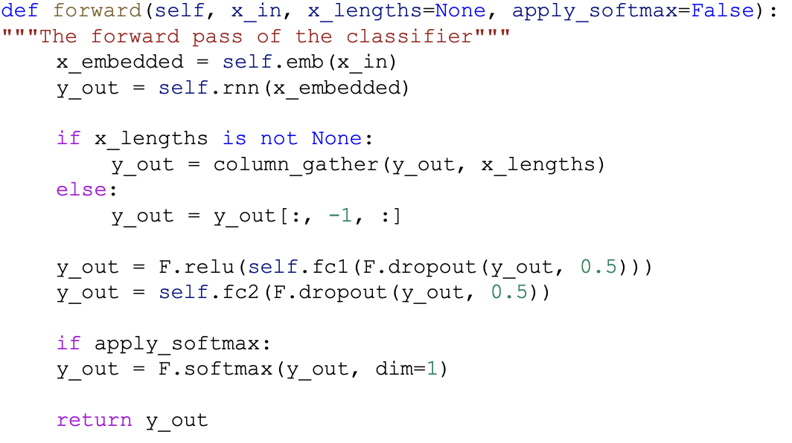|  Embedding Layer와 RNN Layer를 거친 후, MLP Layer를 거쳐서 출력값을 계산.Embedding Layer: 입력 데이터를 받아서, 이를 해당 단어의 임베딩 벡터로 변환합니다. RNN Layer: Embedding Layer를 통해 변환된 임베딩 벡터들을 입력으로 받아서, 순차적으로 RNN의 hidden state를 계산 MLP Layer: RNN Layer를 거쳐서 얻은 hidden state를 받아서, MLP Layer를 통해 최종 출력값을 계산합니다. 이 때, ReLU activation 함수와 Dropout regularization이 사용됩니다. Softmax Activation: 출력값이 확률값으로 표현될 수 있도록, Softmax Activation 함수를 사용하여 계산합니다.
|

