# Intermediate Sequence Modeling for NLP

# Language Modeling
    문장에 대해 probability를 할당
        ex) P(pair|apple and) = 0.012=> apple and 뒤에 pair가 나올 확률
## RNN based Language Modeling
    train data: text corpus
    1. tokeization
        input sentence-> 각각의 token으로 변경
            the -> y1, pen -> y2 ....
        specail case
            - start sentence: <SOS>
            - end of sentence: <EOS>
            - unknown word: <UNK>
        2. supervised traning
            RNN model을 사용하여 token 확률을 모델링
            real output: one hot vector
            model output: softmax vector
|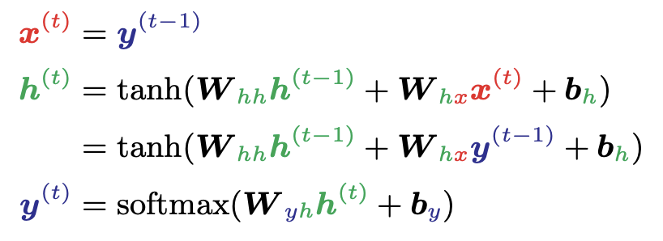| 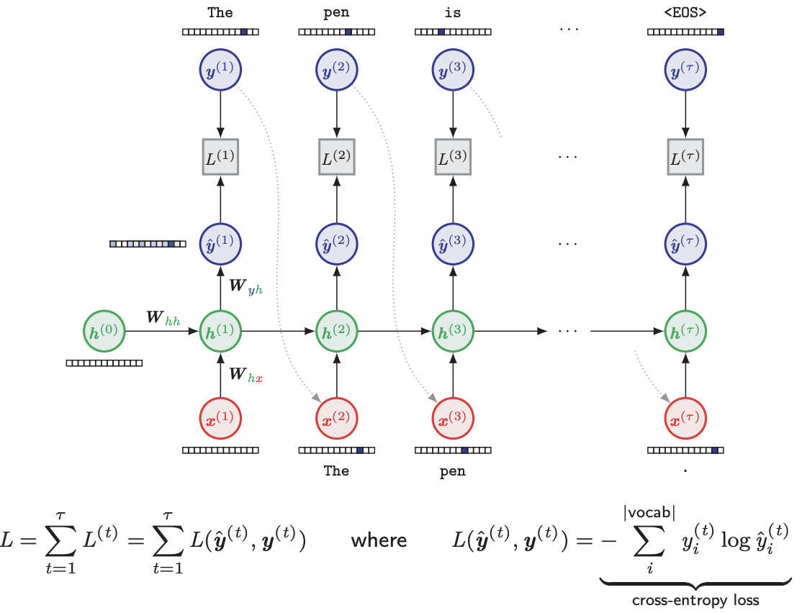|
|---|---|
- y^: softmax vector(probability를 가짐) => ex) the: 0.4 a:0.3, child: 0.1....
-  y: 실제 값 
=> L(y^,y)를 통해 compute loss
- train과정에서는 이전의 ouput이 다음 input

# Various RNN aRchitecture and Beyond

## Bidirectional RNN
    RNN은 원래 과거의 데이터로부터만 학습됨
    하지만 whole sentence가 필요할때도 있음
    h: forward propagate-> 과거에 기반
    g: backward propagate -> 미래의 기반
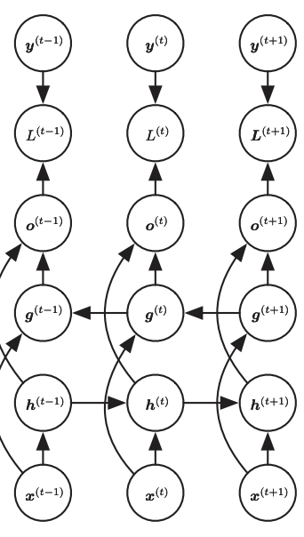

## Deep RNN
    hidden recurrent state를 계층적으로 나눌 수 있음
    RNN에서 hidden state의 크기를 늘리는 대신, 여러 개의 RNN layer를 쌓아서 더 복잡한 모델을 만드는 방법입니다.
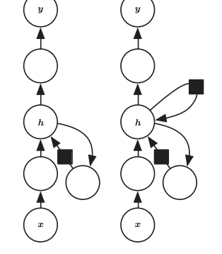

## Gated Recurrent Neural Networks
    Problem:
        바닐라 RNN에서는 가중치 w와 h(t-1)를 현재의 hidden state h(t)를 만들어낸다
        하지만 W가 1보다 크면 => exloding gradient문제(모델의 가중치가 큰값으로 계속 갱신됨)
        w<1 => vanishing gradient 문제(모델의 가중치가 작은값으로 계속 갱신됨)
    
    Gated RNN(위의 문제에 대한 해결책)
        RNN 모델의 발전된 형태 중 하나로, LSTM(Long Short-Term Memory)과 GRU(Gated Recurrent Unit)와 같은 게이트 메커니즘을 사용하여 Gradient vanishing 문제를 해결하고, 긴 시퀀스에서도 정보를 잘 보존할 수 있는 모델
        Gated RNN은 입력과 은닉 상태를 수정하고 업데이트할 때, 이전 정보를 얼마나 보존할지를 결정하는 게이트를 추가하여 Gradient vanishing 문제를 해결합니다. -> 즉 W를 매 step마다 적당히 update
        GRU는 Reset gate, Update gate를 사용하여 이전 정보를 보존하거나 삭제하며, 새로운 정보를 업데이트합니다. 이러한 게이트 메커니즘을 통해 Gated RNN은 RNN과 비교하여 더욱 긴 시퀀스에서도 정보를 보존하고, 더 나은 성능을 발휘합니다.

        LSTM은 Input gate, Forget gate, Output gate를 사용하고,
            forget gate: 어떤 정보를 버릴지 선택
            input gate: 어떠한 새로운 정보르 저장할지 선택
            output gate: 어떠한 부분은 output으로 보낼지 선택
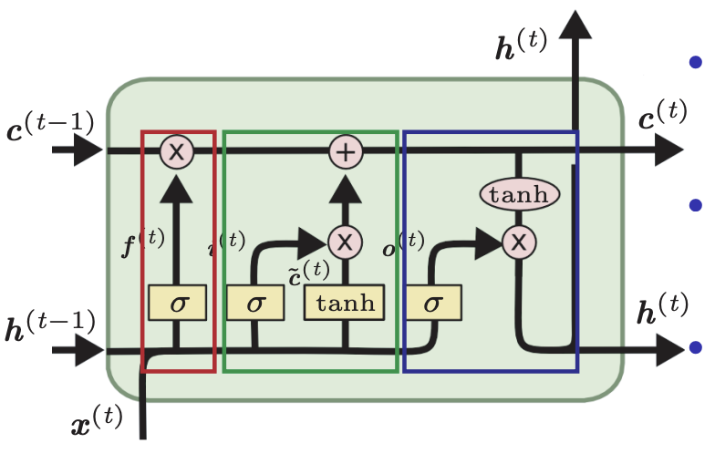 -LSTM 그림

# Surname Classification with Gated RNN
|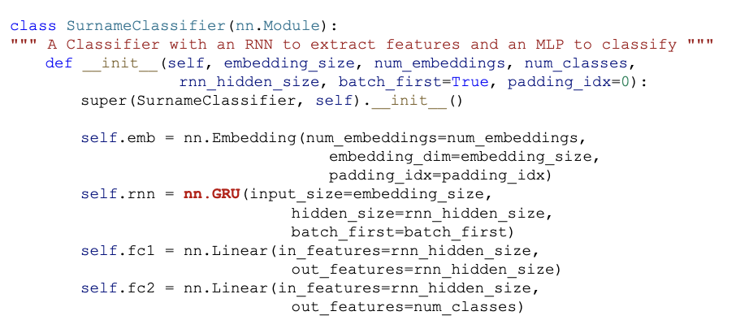| 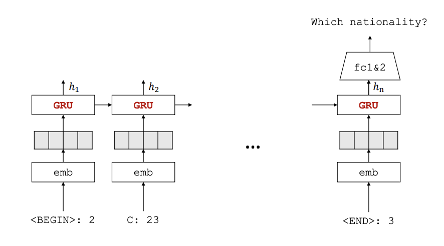|
|---|---|
- 입력으로 문자의 sequence->hidden state 계산 -> MLP를 사용하여 예측
- 임베딩(Embedding) 레이어: 입력 데이터를 임베딩하여 각 문자를 고정된 길이의 벡터로 변환합니다.
- GRU 레이어: 입력 시퀀스의 각 시점마다 히든 스테이트를 계산합니다.
- MLP 레이어: RNN 레이어의 출력을 사용하여 분류 작업을 수행합니다.

# A Character Rnn for Generating Surnames
## Surname Classification vs Generation
    Surname Classification:
        성을 인풋으로 하여 어떠한 나라인지 ouput으로 알려줌
    Generation:
        주어진 문자열 데이터를 기반으로 새로운 문자열을 생성
        주어진 Input에 possibility를 할당하고 새로운 sequence 생성
            -> 국가가 주어지면 이름도 ouput으로 가능
    
## Character - level Generation
    문자 수준의 Generation에서는 이전 output이 다음 input이 되는것이 일반적
    즉, 모델은 다음 문자를 예측하기 위해 이전 ouput을 참고
| 코드| 설명| 
| ----------------- | ----------------- |
| 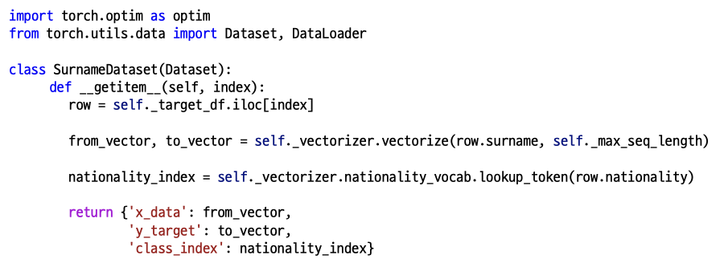| fromvector(입력 sequence), tovector(출력 sequence): surname를 vector한 결과, nationality_index는 해당 데이터 포인트의 'nationality'| 
| 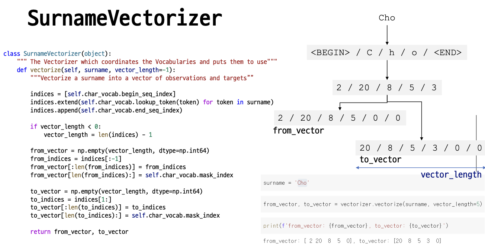| from_vector는 입력 시퀀스의 각 timestep에서 예측을 수행하는 데 필요한 정보를 제공하며, to_vector는 from_vector에 대응하는 timestep에서 모델이 예측해야 할 다음 문자를 나타냅니다.|
| 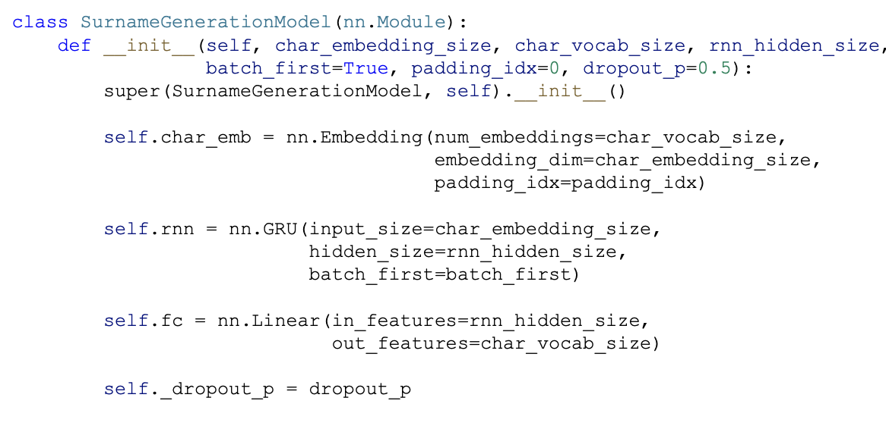|  Embedding Layer : 이 레이어는 character-level 데이터를 받아서, 이를 벡터화, 입력된 character를 one-hot 인코딩하여, 각각의 character를 벡터화 시키는 역할을 합니다.  embedding_dim 파라미터로 character를 몇 차원으로 embedding 시킬지 정합니다. RNN Layer : 이 레이어는 임베딩된 character 데이터를 입력. 이 RNN 레이어는  hidden_size로 정의된 크기의 출력을 생성합니다. 이 모델에서는 nn.GRU를 사용하여, RNN 레이어를 구현,Output Layer : 이 레이어는 RNN 레이어의 출력을 받아서, 다시 character-level 데이터로 변환합니다. 이 레이어는 nn.Linear를 사용하여, RNN 레이어의 출력을 다시 character-level 데이터의 형태로 변환.|
| 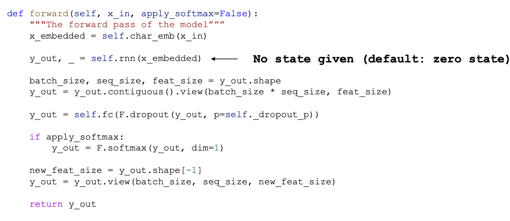|   이 메소드에서는 Embedding Layer, RNN Layer, Output Layer를 차례로 거쳐서 결과값을 출력합니다.  이 모델은 기본적으로 dropout을 적용하도록 구현되어 있습니다. 이 값은 모델의 성능을 개선하기 위한 regularization 방법입니다.|
         
## Sampling from the generation model
    실제 Softmax에 서 나온값을 가지고 주사위를 던지는것과 같이 결과를 받아봄
    -> 매 실행마다 다른 값을 받을 수 있는 이점
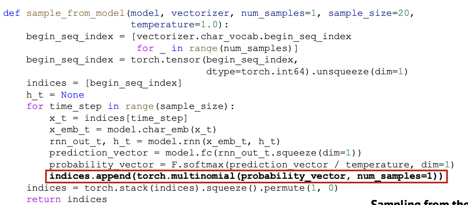

## SurnameGenerationModel w/Condition
    위의 SuranmeClassification과정에서 embedding Layer에 nationalityr관련 정보를 넣는다.
|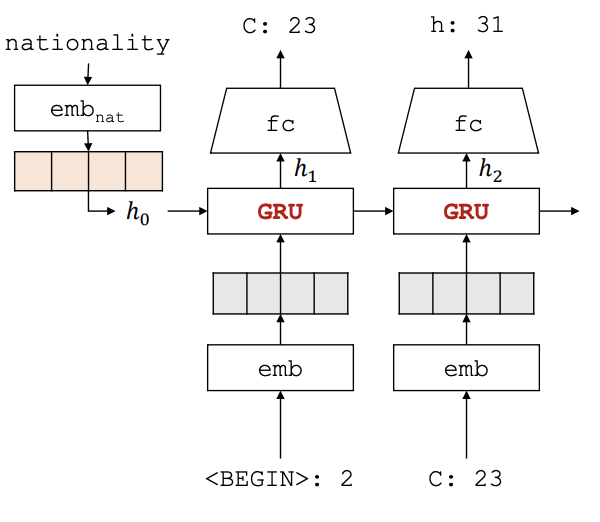|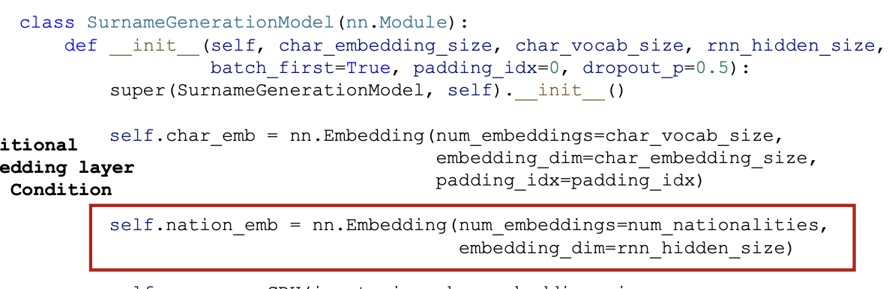|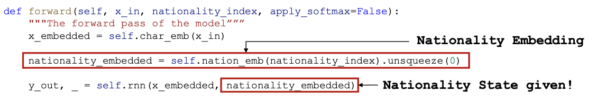|
|---|---|---|
- 국적관련 vector를 embedding -> RNN에 적용
- 실제 foward과정엣 x_embedded와 nationnaltity_embedded의 두개의 인자를 받아 RNN layer에 적용

#### Classification과 Generation의 차이
     Surname Classification은 입력된 성(last name)이 어느 국적(nationality)에 속하는지 예측하는 모델입니다. 즉, 모델의 목적은 입력값에 대한 클래스(class)를 예측하는 것입니다.

    반면에, Surname Generation은 주어진 국적(nationality)에 따라서 성(last name)을 생성하는 모델입니다. 이 모델은 주어진 국적에 맞는 새로운 성(last name)을 생성하는 것이 목적입니다. 따라서 입력값으로는 국적(nationality)이 주어지고, 출력값으로는 해당 국적에 맞는 새로운 성(last name)이 생성됩니다.

    두 모델의 차이점은 입력값과 출력값의 형태와 모델의 목적입니다. Surname Classification은 입력값에 대한 클래스를 예측하는 것이 목적이고, Surname Generation은 주어진 국적에 맞는 새로운 성(last name)을 생성하는 것이 목적입니다.
    