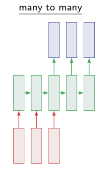
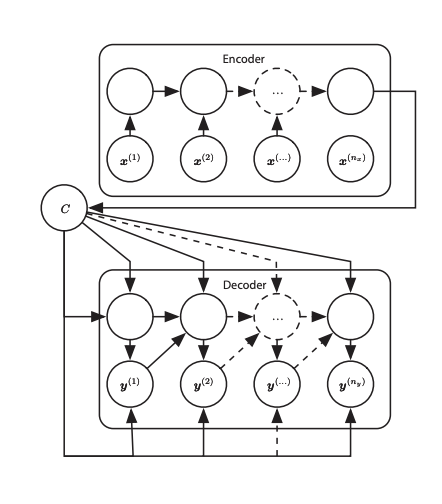
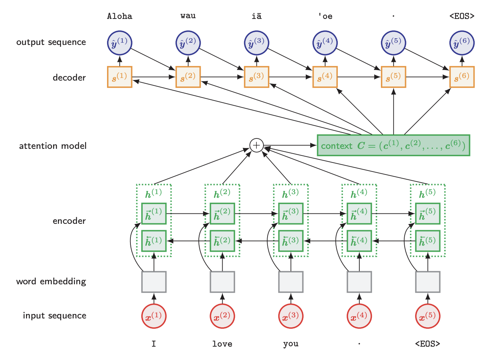
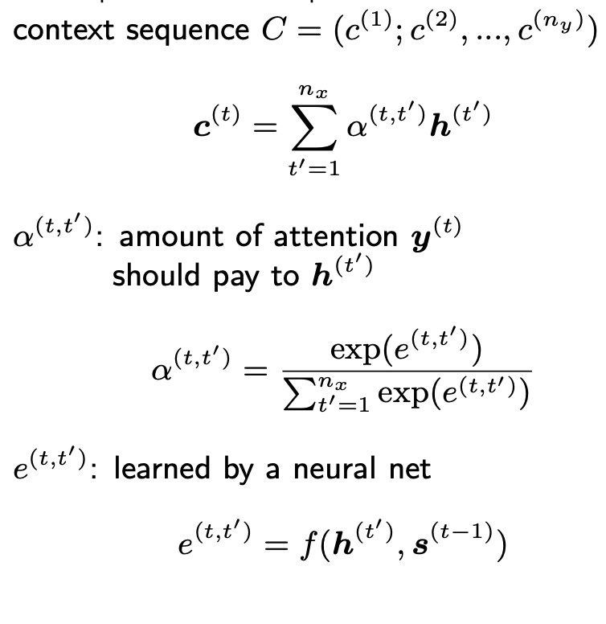
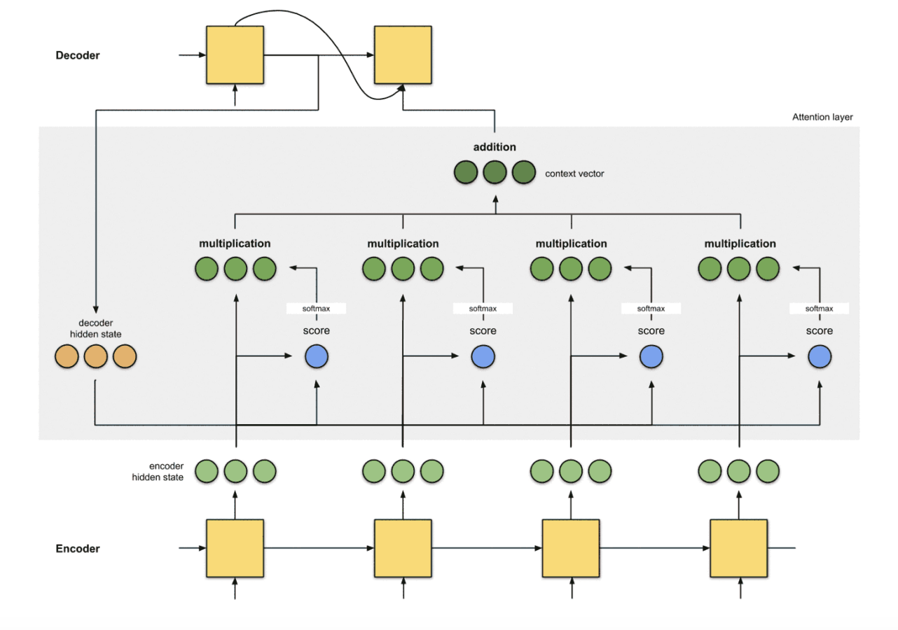

# Advance Sequence Modeling for NLP

## Seq2Seq 
    sequence to sequnce = many to one + one to many
        many to one : encode input-> single vector
        one to many: single vector- > output sentence
    무조건 input sequence랑 Output sequence가 같을 필요 없음!

    encode/reader/input Rnn:
        input: x1,x2....
        output: Context C를 추출: C=input seq의 summarize(일반적으로 고정된 사이즈)
    decode/writer/output Rnn:
        input : Context C
        output: outputseq(y1,y2....)
|||
|---|---|

##  Attention
    Seq2Seq의 한계점: context C는 긴 Input seq를 요약하기에 너무 작을 수 있다. => 해결책: attention mechanism

    Attention mechanism
        C를 고정된 사이즈가 아니라 변경가능한 varaialbe로 만듦
        시퀀스 C의 요소 c(t)와 출력 시퀀스의 요소 y(t)를 서로 연결하도록 학습
|||
|---|---|
- Encoder Rnn: bidirection(양방향)
- C: Encoder Rnn의 output -> input summarize, C= attention*h()
- attention model: s(1),s(2)...와 같이 output의 요소와 C가 서로 연결하도록 학습 하는 모델
- e(t,t'): hidden state와 before output과의 관계 -> 해당 값을 attention의 연산에 사용

- output과 input의 연관성을 고려해 Context Vector 생성 -> 다음 state예측
- decoder hidden 와 encoder hidden state의 연산을 통해 score(e 값- 위에서 적은 e)을 계산
- 2번째 단계인 e를 softmax를 통해 attention 도출
- multiplication 부분: attention*h(hidden state)
- addition 부분(C-context vector): softmax된 multiplication의 합(위에 식 참고 c=시그마 a*h)